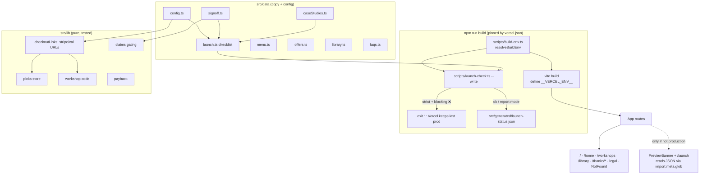
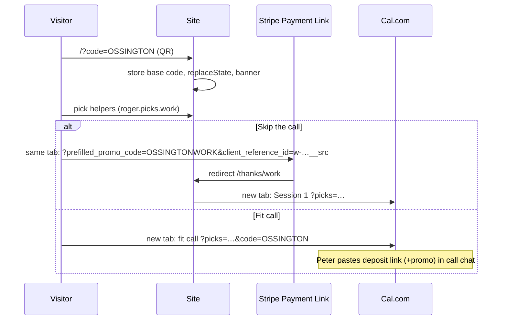

# feat: Roger v3 site — sell the work setup

## Overview

Rebuild the single-page waitlist site (Vite + React 18 + TS + Tailwind + framer-motion) into a multi-route site that sells one product, the $2,000 work setup. `/home`, `/workshops`, `/library`, `/thanks/*` and the legal pages each get their own route. Checkout goes through Stripe Payment Links and booking through Cal.com links. A launch checklist enforced at build time keeps the incomplete site off production until Peter's inputs and sign-offs are in.

**Detailed source of truth:** `artifacts/rogers-v3-design-spec.md` (the spec). It holds all copy, data, section order and acceptance checks. The plan refers to it by section number and does not restate it. The origin requirements doc records decisions that override the spec (see origin: `docs/brainstorms/2026-10-07-roger-v3-site-requirements.md`).

## Problem Frame

The live site collects waitlist signups for a software product, and with its endpoint empty it fakes success. Roger is actually a done-for-you service. v3 has to make saying yes to the work setup easy: one primary CTA (fit call), one shortcut (pay the deposit), honest proof slots that stay hidden until real, and a money-back guarantee. Nothing invented may ship, and no unconfirmed claim may render.

## Requirements Trace

From the origin doc. Spec sections are listed where relevant.

- R1/R2. Build all of spec §5–§10 and §8.4 in §11 order; pass every §12 acceptance check; include the self-grade table at hand-back.
- R3/R3a/R3b. Feature branch, then merge to `main`. **First** ship the live-site waitlist patch. Document how to preview `main` after the merge and the emergency rollback path.
- R4/R4a–d (incl. R4c pre-merge proof, Unit 12). The production gate fails closed, can't be skipped, is verified on real Vercel before merge, and `domain` ships empty.
- R5. Preview deploys show the launch banner.
- R6, R12c. Page-aware header CTA and nav; `/home` shows a "For your business" link.
- R7. Conservative home FAQ answers, gated the same way as the work FAQ.
- R8. Empty interpolations drop their clause.
- R9 (dropped), R9a, R9b. Proof-section empty state; the hero proof line follows the counter rule.
- R10. No stock photo presented as Peter or as a client; the photo hides when missing.
- R11. `/og.png` exists.
- R12, R12a, R12b. Draft legal pages; library zero-results state; form loading and error states.
- R13. Pure logic tested with `node:test` via `tsx`.
- R14. Browser QA at 360px and desktop; Lighthouse ≥ 90 (performance, accessibility) on `/`, `/home` and `/library`.

## Scope Boundaries

- Everything in spec §13 is out: care plans, add-ons, referrals, paid workshops, the Stripe webhook / single-use links, the library pipeline, prerendering.
- Peter's own work (spec §11 table) is out. The build provides slots plus launch-checklist entries only.
- No component or DOM test framework, because the spec allows no new deps beyond `react-router-dom` and `tsx`. UI behaviour is verified in a real browser (Unit 12).
- Library URL verification is attempted, but it's a non-blocking sign-off.

## Context & Research

### Relevant Code and Patterns

- `src/data/config.ts`: the single-source config pattern. It's replaced per spec §8, keeping the "copy lives in `src/data/*.ts`" convention.
- `src/components/FadeUp.tsx`: a motion wrapper that already respects `useReducedMotion`. Reuse it for every animated section.
- `src/components/PhoneMockup.tsx`: reused. It has home/work views, the work view already reads "Monday · 6:48 AM", and its `AnimatePresence` toggle animation is dropped since there's no toggle any more.
- `src/components/ToqueMark.tsx`: brand mark, also the source for the SVG favicon.
- `src/components/TimeMathBand.tsx`: moves to `/home` as the featured example. It keeps its strikethrough (R9 dropped) and its source line; the `WaitlistForm` inside it is removed.
- `src/data/homeContent.ts`: `homeSteps` and `sampleMeals` are reused on `/home`, and `sampleBrief` feeds the work mockup.
- `src/hooks/useWaitlist.ts`: its validation, UTM and POST pattern is reused for the newsletter and workshop forms, minus the simulated success.
- `src/utils/utm.ts` and `src/utils/analytics.ts`: kept. `trackEvent` already gates on `analytics.enabled`.
- `tailwind.config.js`: palette (cream, paper, rule, ink, copper) and fonts kept as they are.
- Leftovers to delete: `src/package.json` (Magic Patterns, mismatched versions, no `"type":"module"`), `src/docs/roger-landing-page-brief.md`, `src/contexts/AudienceContext.tsx`, `src/types/waitlist.ts`, `src/data/workGroups.ts`, `src/data/pageContent.ts`, plus the components only the old page uses (`ProblemSection`, `HomeSection`, `WorkSection`, `StandardBand`, `StorySection`, `HowItWorks`, `WaitlistForm`).
- Environment: Node 22.15, npm 10.9, Vercel CLI installed, no lockfile, `node_modules` not installed, no `.vercel` link locally.

### Institutional Learnings

- No `docs/solutions/` exists yet. This cycle's compound step will create the first entry.

### External References

- **Cal.com prefill:** the query param name is the booking-question identifier (`?picks=…`). Standard params are `name`, `email`, `notes`. Encode with `encodeURIComponent`, since a literal `+` reads as a space. https://cal.com/help/bookings/prefill-fields
- **Stripe Payment Link params:** https://docs.stripe.com/payment-links/url-parameters
  - `client_reference_id` allows `[A-Za-z0-9_-]` up to 200 chars. Invalid values are silently dropped and checkout still loads.
  - `prefilled_promo_code` is **alphanumeric only**, needs promotion codes enabled on the link, and invalid values are ignored.
- **Vercel environment variables:** https://vercel.com/docs/environment-variables/system-environment-variables, https://vercel.com/docs/deployments/promoting-a-deployment, https://vercel.com/docs/project-configuration/vercel-json#buildcommand
  - `VERCEL=1` and `VERCEL_ENV` are present at build when system env vars are exposed.
  - "Promote to Production" on a preview does a **full rebuild** with production env. Instant Rollback and promoting a staged production deploy don't rebuild.
  - `vercel deploy --prod --skip-domain` makes a staged production build.
  - A failed build never becomes Current.
  - `vercel.json` `buildCommand` overrides both the dashboard and package.json.
- **Vite 5 `define` + dead-code elimination:** tested on 5.4.21. The chunk is dropped only when the `lazy(() => import(...))` call is itself inside the `__VERCEL_ENV__` condition. An eager `import.meta.glob` for a missing file returns `{}`.
- **tsx test runner:** `tsx --test` runs `node:test`. npm scripts on Windows use cmd.exe, so quote globs (Node 22 expands them) or list files explicitly.
- **React Router v7 declarative mode** (`BrowserRouter`, installed as `react-router-dom@7`) doesn't scroll to hashes across routes, so a small custom effect is needed. https://reactrouter.com/start/modes

## Key Technical Decisions

- **Router: `react-router-dom@7` in declarative mode.** v6 is in maintenance, and the spec names the package, not the version. A `ScrollToHash` effect handles `/#pricing` and the nav anchors across routes, honouring reduced motion.
- **Gate mode function shared by the script and `vite.config.ts`.** One pure `resolveBuildEnv(env)` in `scripts/build-env.ts` decides `strict` vs `report` and the `__VERCEL_ENV__` value:
  - Strict when `VERCEL_ENV === 'production'`, or when `VERCEL === '1'` and `VERCEL_ENV !== 'preview'`.
  - On Vercel with no `VERCEL_ENV`, `__VERCEL_ENV__` becomes `'production'`.
  - **Invariant:** `mode === 'strict'` ⇔ `define === 'production'`. Tests assert the (mode, define) pair for every row, so a build that passes strict can never include the banner.
  - This fails closed (R4a) while keeping local builds non-strict unless explicitly asked for.
- **Gate inside `build`, pinned by `vercel.json`.**
  - `build` = launch-check `--write` (strict per the env), then `vite build`.
  - `predev` writes the status file.
  - `vercel.json` carries `buildCommand: "npm run build"` and the SPA rewrite.
  - This deliberately differs from spec §8.4.4, which uses `prebuild`, so that hooks can't silently vanish (R4b).
- **Banner and `/launch` excluded from production by construction.** Both the `lazy()` import and the route registration sit inside `if (__VERCEL_ENV__ !== 'production')`. The status JSON is read with an eager `import.meta.glob` *inside the lazily loaded module*, so it never enters the production bundle.
- **Workshop codes are alphanumeric and allow-listed** (deviation from spec §9.3's `{GROUP}-WORK`, forced by Stripe).
  - Normalise `?code=`: uppercase, strip non-alphanumerics. **No suffix stripping**, so a group like `NETWORK` survives.
  - The QR carries only the group: `/?code={GROUP}`.
  - Each link gets `{GROUP}WORK` or `{GROUP}HOME`.
  - A code is stored, bannered and appended **only if it appears in `config.workshopCodes: string[]`** (the groups Peter has created in Stripe). Unknown codes are ignored, so no discount is promised that Stripe won't apply.
  - The README tells Peter to create Stripe promotion codes as `{GROUP}WORK` / `{GROUP}HOME` and add `{GROUP}` to config.
- **Picks are a reactive store.** A `usePicks(kind)` hook over a tiny `useSyncExternalStore` store, backed by the injected storage. Every CTA builds its URL from it, so the pricing card, sticky bar and summary panel never send stale picks.
- **Picks use separate keys** `roger.picks.work` and `roger.picks.home` (deviation from spec §9.5's single key, to avoid collisions). On read, unknown ids are dropped and the list is cut to the picker's max.
- **Stripe opens in the same tab** so sessionStorage survives to `/thanks/*`. Cal links and outbound library links open in a new tab.
- **The fit-call Cal link also carries `code`** as a prefilled question, so the workshop discount isn't lost on the main conversion path. The README tells Peter to add a `code` question and to append `?prefilled_promo_code=` when pasting the deposit link on the call.
- **Pure logic lives in `src/lib/`**, free of framework code (no `import.meta`, JSX or DOM globals; storage is injected). `node:test` can import it, and so can the Node launch script.
- **One `Cta` primitive** renders either a link (`<a>`, with tracking) or a `<button disabled>` reading "Opening soon" (dev console warning, no tracking). Copy that only makes sense next to a live CTA (e.g. "Next available: within 1 business day", the "first 15 minutes" line) hides with it.
- **Tests:** `node:test` via `tsx`, files listed explicitly in the `test` script. No component tests (no jsdom allowed). The UI is checked in a real browser.

## Open Questions

### Resolved During Planning

- Cal prefill format: `?picks=<encoded human-readable titles, comma-joined>`, built with `URLSearchParams`.
- Is `VERCEL_ENV` reliable? Not assumed. The gate fails closed (above).
- Does "Promote to Production" leak the banner? No. Promote rebuilds with production env, so the gate and define resolve to production.
- Does `prebuild` run on Vercel? Moot, because the gate is in `build` itself and `vercel.json` pins the command.
- `launch-status.json` on a fresh clone: `predev` and `build` both write it, and the banner module tolerates `{}`.
- Empty-picks thanks pages, direct visits, and Cal links missing on a paid thanks page: render fully, omit the `picks` param, and replace "Opening soon" with "I'll email you within 1 business day to book" (plus `contactEmail` when set). Pages are `noindex` and fire no conversion event.
- Library params: `for`, `cat` (single), `q`. Invalid values are ignored and removed with `replaceState`. All filter changes use `replaceState`. Home-job example links carry `for=home`.
- Unknown routes, including `/launch` in production: a `NotFound` page with links to `/`, `/home` and `/library`, `noindex`.
- Sticky bar: hidden when all its CTAs are disabled; otherwise only the live ones show.
- `?code=` is removed from the URL with `replaceState` after it's stored, and a newer code overwrites the old one.

### Deferred to Implementation

- Exact visual composition of the hero without a photo (the mockup on a copper-wash panel is the starting point). Judge it in the browser.
- How to render `/og.png` with no new deps: an HTML/SVG source screenshotted once with local headless Edge/Chrome. The PNG is committed and the source kept next to it.
- Running Lighthouse via `npx lighthouse` (fetched at run time, not added as a dependency) against `vite preview`.
- Whether the 33 library URLs resolve. X often blocks unauthenticated fetches; record what can be confirmed and leave `libraryVerified` false.
- The Vercel dashboard checks (production branch is `main`, system env vars exposed, Build Command). These need Peter's Vercel access or a linked CLI and are done in Unit 12.

## High-Level Technical Design

> *This illustrates the intended approach and is directional guidance for review, not implementation specification. The implementing agent should treat it as context, not code to reproduce.*

Checkout flow (work):

## Implementation Units

### Phase A — Protect the live site

- [x] **Unit 1: Live-site waitlist patch (ships on `main` before v3)**

**Goal:** Stop the current production site from faking waitlist success.

**Requirements:** R3a

**Dependencies:** None. Lands on `main` first; the v3 branch is cut afterwards.

**Files:**
- Modify: `src/hooks/useWaitlist.ts`, `src/components/WaitlistForm.tsx`

**Approach:**
- When `waitlistEndpoint` is empty, don't simulate success. Render an honest state instead: "Signups aren't open yet." With a contact route only when a real `contactEmail` exists. The current `hello@example.com` placeholder must not be shown as a contact.
- Smallest possible diff. This code is deleted in Unit 2.

**Test expectation:** none. Throwaway patch on code that v3 deletes; verified manually in the browser.

**Verification:**
- Submitting the form on the deployed site no longer says "You're on the list".
- Production deploys from `main` succeed. This happens before the v3 gate exists.

### Phase B — Foundation

- [x] **Unit 2: Scaffolding, data files and waitlist removal**

**Goal:** The router shell, new data files and the cleanup that spec chunk 1 needs.

**Requirements:** R1 (spec §5, §8, §8.2, §10, §11 chunk 1), R4d

**Dependencies:** Unit 1 merged; work continues on the v3 feature branch.

**Files:**
- Modify: `package.json` (name `roger-site`; add `react-router-dom@7` and dev `tsx`; scripts `dev`/`predev`/`build`/`test`/`launch-check`; drop the `npx` prefixes), `src/index.tsx`, `src/App.tsx`, `src/data/config.ts` (spec §8 shape, `domain: ''`), `src/data/faqs.ts`, `.gitignore` (`src/generated/`)
- Create: `vercel.json` (rewrite + `buildCommand`), `src/data/offers.ts`, `src/data/menu.ts`, `src/data/caseStudies.ts` (typed, empty), `src/data/library.ts` (33 seed entries, Appendix A), `src/data/copy/*.ts` as needed for page copy, `src/vite-env.d.ts` (declares `__VERCEL_ENV__`), placeholder page components per route
- Delete: `src/package.json`, `src/docs/roger-landing-page-brief.md`, `src/contexts/AudienceContext.tsx`, `src/types/waitlist.ts`, `src/data/workGroups.ts`, `src/data/pageContent.ts`, `src/pages/Landing.tsx`, the old-page-only components, unused stock JPGs (keep one only if Unit 9 uses it decoratively)
- Generate: a `package-lock.json` from the first install (commit it for reproducible Vercel builds)

**Approach:**
- `CaseStudy.permission` typed as the literal `true` (spec §6.4).
- Library seed: transcribe Appendix A exactly. `kids-shoes-miss` gets `outcome: 'honest-miss'` and its summary loses the "outcome: honest-miss" text. ★ entries get `featured: true`. `weekOf` w1 = 2026-09-23, w2 = 2026-09-30.
- Menu helper items whose category has no examples (marketing, staff, shop-ops) link to `/library?for=work` (spec §4 rule). Implement this as a derived link, not hard-coded.
- Pin `autoprefixer`/`postcss` to concrete versions in place of `latest`.
- `@types/node` is already a devDependency, so tests need no new types package. The build doesn't run `tsc`. Exclude `**/*.test.ts` from the app `tsconfig.json` and add a small `tsconfig.node-tests.json` (or extend `tsconfig.node.json`) covering tests and `scripts/`, so the editor and an optional `tsc --noEmit` type-check them.

**Patterns to follow:** existing `src/data/config.ts` single-source style; copy only in `src/data/`.

**Test scenarios:**
- Happy path: `library.ts` has 33 entries with unique ids, and every `menuItemId` exists in `menu.ts`.
- Edge case: every menu item's `libraryCategory` is a valid `UseCaseCategory`.
- Happy path: 8 helpers and 12 home jobs, with the ids exactly as in spec §4.
- Test file: `src/data/data.test.ts`

**Verification:**
- The app builds and every route resolves to a placeholder.
- `grep -ri waitlist src` returns nothing.
- No `src/package.json`.

- [ ] **Unit 3: Checkout and state logic library**

**Goal:** Pure, tested modules for every URL and state rule in spec §9.

**Requirements:** R1 (spec §9.1–§9.5, §6.7 calculator, §11 chunk 4 with Unit 7), R8, R13

**Dependencies:** Unit 2

**Files:**
- Create:
  - `src/lib/checkoutLinks.ts`: Stripe deposit/home URL, Cal fit/session URLs
  - `src/lib/picks.ts`: storage keys, read/write/sanitise with injected storage
  - `src/lib/workshopCode.ts`: normalise, base and suffix, per-offer code
  - `src/lib/clientReference.ts`: build and sanitise
  - `src/lib/payback.ts`
  - `src/lib/claims.ts`: sign-off gated copy helpers; clause-dropping interpolation per R8
  - `src/lib/browserStorage.ts`: try/catch `sessionStorage` adapter, the only DOM-touching file
- Test: `src/lib/checkoutLinks.test.ts`, `src/lib/picks.test.ts`, `src/lib/workshopCode.test.ts`, `src/lib/clientReference.test.ts`, `src/lib/payback.test.ts`, `src/lib/claims.test.ts`

**Execution note:** Implement test-first. These modules are the contract the CTAs, thanks pages and analytics depend on.

**Approach:**
- An empty base link returns `null`. That signals "Opening soon", not a broken URL.
- Params go through `URLSearchParams` so encoding is correct.
- The Cal `picks` value is human-readable titles, comma-joined; the param is omitted when there are no picks. `code` is added only to the fit-call URL.
- `client_reference_id`:
  - Format: `{w|h}-{ids without the work-/home- prefix, '-'-joined | none}__{utm_source|direct}`.
  - Sanitise to `[A-Za-z0-9_-]` and cap at 200 chars, truncating the picks part first so the source survives.

**Test scenarios:**
- Happy path:
  - Deposit link + picks `[work-customers, work-invoices, work-leads]` + utm `bia-ossington` → `client_reference_id=w-customers-invoices-leads__bia-ossington`.
  - No picks, no utm → `w-none__direct`.
  - Workshop code base `OSSINGTON` → deposit URL has `prefilled_promo_code=OSSINGTONWORK`; home URL has `OSSINGTONHOME`.
  - Cal fit URL with picks → `picks=Customer%20messages%2C…`, decoding to readable titles.
  - Payback: `ceil(2000/(3×50))` → 14. Home: `ceil(500/(3×50))` → 4.
- Edge case:
  - utm `"BIA Ossington!!"` → sanitised `BIA-Ossington` (or with the characters stripped). The result matches `^[A-Za-z0-9_-]{1,200}$`.
  - A very long utm → total ≤ 200 and the `__` separator survives.
  - Base link already has a query string → params are appended with `&`.
  - `?code=ossington` with `OSSINGTON` allow-listed → stored; links get `OSSINGTONWORK`/`OSSINGTONHOME`.
  - `?code=Oss-ington!` → `OSSINGTON`.
  - `?code=NETWORK` allow-listed → `NETWORKWORK`/`NETWORKHOME`, never stripped.
  - `?code=FREE` not allow-listed → ignored: no storage, no banner, no param.
  - Empty allow-list → codes are never applied.
  - Stored work picks containing a home id or an unknown id → dropped. 4 valid work ids → cut to 3. Home cut to 5.
  - Payback with hours 0 or a rate of 0 → no "Infinity". Inputs are clamped to the spec ranges (hours 1–10).
  - `providerCostRange` empty → FAQ #3 and the honesty line drop the clause, with no "usually  a month".
- Error path:
  - The storage adapter throws (private mode) → reads return empty and writes are no-ops, with no exception.
  - Corrupt JSON in storage → empty picks.
  - Empty `cal.fitCall` / `stripe.workDeposit` → the builder returns `null`.
- Integration: the picks written by `/` are read by the thanks-page builder and produce the Cal `picks` param (both modules over the same in-memory storage).

**Verification:** All `src/lib` tests pass under `npm test`, and the modules import no React, DOM globals or `import.meta`.

- [ ] **Unit 4: Launch checklist and production gate**

**Goal:** Spec §8.4 with the fail-closed tightening from the origin doc.

**Requirements:** R1 (spec §8.4.1–§8.4.7, §11 chunk 8), R4, R4a, R4b, R5

**Dependencies:** Unit 2 (config and data shapes), Unit 3 (`claims.ts` reads `signoff`)

**Files:**
- Create: `src/data/signoff.ts` (spec §8.4.1 keys plus `libraryVerified`), `src/data/launch.ts` (the 29 spec items, evaluated through an injected `assetExists`), `scripts/build-env.ts`, `scripts/launch-check.ts`, `src/components/launch/PreviewBanner.tsx`, `src/pages/LaunchPage.tsx`
- Modify: `vite.config.ts` (define `__VERCEL_ENV__` from `resolveBuildEnv`), `src/App.tsx` (conditional lazy registration)
- Test: `src/data/launch.test.ts`, `scripts/build-env.test.ts`

**Execution note:** Implement test-first for `resolveBuildEnv` and the checklist evaluation.

**Approach:**
- `launch-check` prints the grouped table and the summary line `Launch check: X/Y done · N blocking`. In strict mode with any blocking ❌, it exits 1 and lists the missing items. It always prints `env=<VERCEL_ENV|unset> vercel=<0|1> mode=<strict|report>` first.
- `--write` writes `src/generated/launch-status.json`. The build always writes the file before `vite build`.
- The banner is a slim fixed strip (preview only). The `/launch` page renders the grouped list. Both live only in the lazily imported modules.
- The `case-studies` gate uses the spec rule: ≥ 3 entries with permission and ≥ 1 metric, ≥ 2 of them work.

**Test scenarios:**
- Happy path:
  - Today's empty config → every config, gate and sign-off item ❌ except `founding-perk`/`home-lead` (non-blocking).
  - Blocking count equals the number of spec blocking items.
  - The summary string is formatted per spec.
- Edge case (`resolveBuildEnv`):
  - `{}` (local) → report, define `development`.
  - `{VERCEL_ENV:'production'}` (local explicit) → strict.
  - `{VERCEL:'1', VERCEL_ENV:'preview'}` → report, define `preview`.
  - `{VERCEL:'1', VERCEL_ENV:'production'}` → strict.
  - `{VERCEL:'1'}` with VERCEL_ENV missing → strict, define `production`.
  - `{VERCEL:'1', VERCEL_ENV:'development'}` → strict.
  - Every strict row defines `production`; every report row defines non-production (the invariant).
- Edge case (checklist):
  - `founder.name: 'Peter'` → ❌; `'Peter Kuperman'` → ✅.
  - A Stripe link that doesn't start with `https://buy.stripe.com/` → ❌.
  - Invalid `contactEmail` → ❌.
  - 3 case studies with only 1 work → ❌.
  - A case study with `metrics: []` → doesn't count.
  - `workshopsBooked: 1` → ❌; `2` → ✅.
- Integration (verified in Unit 12, not node:test):
  - A strict local build fails and lists the blockers; a normal build passes.
  - `dist/` contains no banner string and no Launch chunk in a strict-mode env build where the checks pass. A temporary all-✅ fixture proves exclusion; it's not committed.

**Verification:**
- `npm run launch-check` prints the table.
- The preview/local build shows the banner and `/launch`.
- The production-mode bundle has neither.

### Phase C — Shared UI

- [ ] **Unit 5: Layout, CTA primitives and shared sections**

**Goal:** The components shared across pages, built once.

**Requirements:** R1 (spec §6.1, §6.4, §6.8–§6.12, §8.1, §8.3, §9.6, §9.7, §10 a11y), R6, R8, R9a, R9b, R10, R12b, R12c

**Dependencies:** Units 3 and 4

**Files:**
- Create in `src/components/`:
  - Layout: `layout/SiteLayout.tsx`, `layout/Header.tsx` (rewrite, page-aware, hamburger), `layout/Footer.tsx` (rewrite), `layout/ScrollToHash.tsx`, `layout/usePageMeta.ts` (title, description, robots)
  - Calls to action: `cta/Cta.tsx`, `cta/StickyCtaBar.tsx`, `cta/WorkshopCodeBanner.tsx`
  - Forms: `forms/NewsletterForm.tsx`, `forms/useFormPost.ts` (replaces `useWaitlist`)
  - State: `src/hooks/usePicks.ts` (`useSyncExternalStore` over `src/lib/picks.ts`), `src/hooks/useWorkshopCode.ts`
  - Sections: `sections/ProofSection.tsx`, `sections/GuaranteeBand.tsx`, `sections/AboutPeter.tsx`, `sections/FaqList.tsx`, `sections/BeforeAfter.tsx`, `sections/Picker.tsx`, `sections/PricingCard.tsx`, `sections/DiyTable.tsx`, `sections/PaybackCalculator.tsx`, `sections/Timeline.tsx`, `sections/FinalCta.tsx`
- Delete: old `Header.tsx`, `Footer.tsx`, `FAQ.tsx`, `FinalCTA.tsx`, `hooks/useWaitlist.ts`, `WaitlistForm.tsx`

**Approach:**
- `Cta` takes a link builder result (`string | null`) plus the analytics event. `null` renders `<button disabled>` with "Opening soon" and a dev-only console warning.
- Picker:
  - Chips are `aria-pressed` toggles with a max. An over-max tap shows the inline message (spec §6.5) in a polite live region. Changes fire `picker_change`.
  - Picks persist through `src/lib/picks.ts`.
  - "See real examples" link per chip.
- The proof section hides each slot when empty; R9a sets its empty state.
- Hero proof-line helper per R9b.
- `GuaranteeBand` and `PricingCard` are parameterised for work and home text. Claims render through `claims.ts` gating (spec §8.4.3).
- Sticky bar:
  - Below 768px only, once the page's hero CTA has left the viewport (IntersectionObserver).
  - Hidden while a form field has focus or the final CTA band is visible, and hidden when all its CTAs are disabled.
  - 56px tall, with `env(safe-area-inset-bottom)` padding.
- Forms: labelled fields and inline errors. While posting the button is disabled. Errors per R12b. An empty endpoint means "Opening soon", never success.
- `ScrollToHash`: on pathname or hash change, scroll to the element (retry one frame) or to the top, respecting reduced motion.
- Header:
  - Page-aware CTA (R6); nav anchors resolve to the current page's sections, or `/#…` elsewhere.
  - On `/home` the "For your home" link becomes "For your business" (R12c).
  - Mobile menu: a button with `aria-expanded`, closes on link click and on Escape, and returns focus to the toggle.
- AA contrast on the ink pricing card: cream text on ink; muted text no lower than `cream/80`. Check with a contrast tool in Unit 12.

**Patterns to follow:** existing class vocabulary (`font-serif`, `border-rule`, `bg-copper-wash`, `text-ink-soft`); `FadeUp` for motion.

**Test scenarios:** Component behaviour is browser-verified in Unit 12; logic is covered by Unit 3. Browser checklist items:
- Picker: 4th tap → message, 3 still selected, `aria-pressed` correct.
- Disabled CTA is not focusable as a link, reads "Opening soon", and fires no event.
- Sticky bar appears after the hero CTA scrolls out, hides when an input is focused, and is absent when all its CTAs are disabled.
- Proof section with everything empty shows only "What I won't do", with no orphan heading.
- Newsletter with an empty endpoint shows "Opening soon"; with a failing endpoint (an unreachable URL in a local override) shows the inline error and keeps the email.

**Verification:** A storybook-style smoke route isn't needed. Each component is exercised on the pages in Units 6–10 and checked in Unit 12.

### Phase D — Pages

- [ ] **Unit 6: Main page `/`**

**Goal:** The 10 sections in spec order, selling only the work setup.

**Requirements:** R1 (spec §6, §11 chunks 2–3), R9b, R10

**Dependencies:** Unit 5

**Files:**
- Create: `src/pages/WorkPage.tsx`, `src/components/sections/WorkHero.tsx`, `src/components/sections/WhatYouGet.tsx`, `src/data/copy/work.ts`
- Modify: `src/components/PhoneMockup.tsx` (single-view prop, label "Your Chief of Staff · Monday 6:48 AM", remove the AnimatePresence toggle)

**Approach:**
- Section order exactly per spec §6.1–§6.11; nothing else on the page.
- The headline variant comes from `config.headline`.
- The hero visual is `PhoneMockup` on a neutral panel. Peter's photo renders only when `config.founder.photo` is non-empty. It ships `''` (a deviation from the spec's `'/peter.jpg'` default) and the `founder-photo` launch item requires the field set **and** the file present. The photo flag is never read from launch-status.json, which production excludes. Never a stock photo standing in for Peter.
- Pricing section `id="pricing"`. The home line under pricing is the only home mention besides the header link.
- Copy in `src/data/copy/work.ts`, verbatim from the spec.

**Test scenarios:** Test expectation: none in node:test, since the page is composition. Browser checks:
- The 5-second test (what's sold, the price, what to click).
- `/#pricing` from `/library` lands on the pricing card.
- Exactly one pricing card; no workshop or library sections.

**Verification:** The spec §12 first-bullet check passes by inspection.

- [ ] **Unit 7: Thanks pages and NotFound**

**Goal:** Post-payment booking pages and a catch-all.

**Requirements:** R1 (spec §9.2, §9.4)

**Dependencies:** Units 3 and 5

**Files:**
- Create: `src/pages/ThanksWorkPage.tsx`, `src/pages/ThanksHomePage.tsx`, `src/pages/NotFoundPage.tsx`, `src/data/copy/thanks.ts`

**Approach:**
- Both thanks pages read their picks key and build the session Cal link with picks; a missing Cal link falls back to the email message.
- Checklists per spec. `noindex`, no nav CTA conversion events. Picks are never cleared on mount.
- NotFound is `noindex`, with links to `/`, `/home` and `/library`.

**Test scenarios:** Covered by the Unit 3 builder tests. Browser checks:
- `/thanks/work` after picking 3 helpers → Cal link carries the picks.
- `/thanks/work` in a fresh private window → renders, no `picks` param.
- `/launch` on a production-mode build → NotFound.

**Verification:** Both thanks pages render correctly with and without picks and with empty Cal config.

- [ ] **Unit 8: Home page `/home`**

**Goal:** The spec §6A page for parents.

**Requirements:** R1 (spec §6A, §11 chunk 5), R7, R12c

**Dependencies:** Unit 5

**Files:**
- Create: `src/pages/HomePage.tsx`, `src/components/sections/HomeHero.tsx`, `src/data/copy/home.ts`, `src/data/homeFaqs.ts`
- Modify: `src/components/TimeMathBand.tsx` (remove the waitlist form, keep the source line and strikethrough), `src/data/homeContent.ts` (keep `homeSteps` and `sampleMeals`; drop the unused features)

**Approach:**
- Section order per spec §6A.
- The pricing card uses the home params. "within 3 business days" is gated by `homeSessionLeadConfirmed`, with the fallback "Pick a time that suits you".
- Home FAQ: allergies and picky eaters, grocery delivery account, partner use. Answers promise only what the home menu says (R7). The shared ownership, password and cost items reuse the gated work answers.
- Sticky bar: "Pay $500 & book". The picker max is 5, stored in `roger.picks.home`.

**Test scenarios:** Browser:
- Picking 6 → the over-max message.
- The pay CTA carries `h-…` in `client_reference_id`.
- A workshop banner shows the HOME code wording.

**Verification:** The 5-second test for a parent; the spec §6A item list is ticked off.

- [ ] **Unit 9: Workshops page `/workshops`**

**Goal:** The host-facing page and request form.

**Requirements:** R1 (spec §6B, §11 chunk 6), R12b

**Dependencies:** Unit 5

**Files:**
- Create: `src/pages/WorkshopsPage.tsx`, `src/components/forms/WorkshopRequestForm.tsx`, `src/data/copy/workshops.ts`
- Test: `src/lib/workshopForm.test.ts` (validation logic extracted to `src/lib/workshopForm.ts`)

**Approach:**
- Fields per spec, with required markers and UTM hidden fields. The host pack link shows only when `workshopHostPack` is set. Proof: endorsements and workshop counter, hidden if empty.
- POST JSON to `forms.workshopEndpoint`. Success copy per spec; errors per R12b. Fires `workshop_request_submit`.

**Test scenarios:**
- Happy path: all required fields valid → the payload contains the fields and the UTM params.
- Error path: missing organisation, name or email → field-specific errors. Invalid email → the email error.
- Edge case: optional fields empty → omitted, or empty strings without failing.

**Verification:** The form posts to a test endpoint (or shows "Opening soon" when empty) with real success and error handling.

- [ ] **Unit 10: Library page `/library`**

**Goal:** A browsable, filterable use-case library routing back to the offers.

**Requirements:** R1 (spec §7, §11 chunk 6), R12a

**Dependencies:** Units 2 and 5

**Files:**
- Create: `src/pages/LibraryPage.tsx`, `src/components/library/UseCaseCard.tsx`, `src/components/library/LibraryFilters.tsx`, `src/lib/libraryFilter.ts`
- Test: `src/lib/libraryFilter.test.ts`

**Approach:**
- `libraryFilter.ts` parses and normalises URL params and filters the entries: featured first, then `weekOf` descending, then seed order.
- Cards:
  - Text only. "Read the original ↗" opens a new tab with `noopener noreferrer nofollow`.
  - "I can set this up for you →" goes to `/#pricing` (work) or `/home` (home).
  - honest-miss tag.
- A fit-call band halfway through and at the end, plus the newsletter form. Sticky bar: "Book fit call".
- Events: `library_filter`, `library_outbound`, `library_to_offer`.

**Test scenarios:**
- Happy path:
  - `?for=work` → only work entries.
  - `?cat=money` → 7 money entries.
  - `?q=gift` → matches `money-gift-cards`.
  - Featured entries sort first.
- Edge case:
  - `?cat=bogus&for=x` → params ignored (normalised to all).
  - `?cat=kids&for=work` → zero results (the R12a empty state triggers).
  - Search is case-insensitive and trims whitespace.
- Integration: the normalised params serialise back to a canonical query string (round trip).

**Verification:** Filters sync to the URL without adding history entries, and the zero-results state renders.

### Phase E — Polish, verify, ship

- [ ] **Unit 11: Legal pages, SEO, analytics, README**

**Goal:** Spec §5 meta, §6.12 legal, §9.7 events, §10 README and SEO.

**Requirements:** R1 (§11 chunk 7 with Unit 12), R11, R12, R3b

**Dependencies:** Units 6–10

**Files:**
- Create: `src/pages/LegalPage.tsx` (one component, three content entries), `src/data/copy/legal.ts`, `public/favicon.svg` (toque mark), `public/og.png` (+ `public/og-source.html`), `src/components/layout/JsonLd.tsx`
- Modify: `index.html` (title, favicon, OG/Twitter tags, default description), `README.md` (rewrite)

**Approach:**
- `/refunds` uses spec §3.5 verbatim plus how to claim. `/terms` and `/privacy` are short plain-language drafts with a visible "Draft — under review" banner.
- JSON-LD `ProfessionalService`, `areaServed: Toronto`, with offers for $2,000 and $500 CAD. The `url` is omitted while `domain` is empty.
- Per-route title, description and `noindex` through `usePageMeta`.
- Audit the analytics events against the §9.7 list.
- README sections:
  - run, test, build and deploy
  - copy locations
  - `npm run launch-check` as the TODO source of truth
  - workshop code naming (`{GROUP}WORK`/`{GROUP}HOME`, QR `/?code={GROUP}`) and the Cal `picks`/`code` questions
  - the balance link (README only, never in config)
  - previewing `main` after merge (`vercel deploy`), the emergency Instant Rollback note, and "don't flip the last sign-off without checking a preview of the final config"
  - Stripe after-payment redirect: an absolute `https://{domain}/thanks/work` (and `/thanks/home`) on the **same origin** that serves checkout, so sessionStorage picks survive
  - never use `vercel deploy --prebuilt --prod` (it bypasses the production-mode rebuild)

**Test scenarios:** Test expectation: none for content. Browser check: each route's `<title>`; `/og.png` returns an image.

**Verification:** Every §9.7 event name appears at its trigger point.

- [ ] **Unit 12: Verification, gate proof and self-grade**

**Goal:** Prove R4/R14 and the spec §12 checklist; produce the §2 self-grade.

**Requirements:** R2, R4, R4c, R14

**Dependencies:** All prior units

**Files:**
- Modify: any fixes found; no new feature files.

**Approach:**
- Browser QA (Chrome) of every route at 360px and desktop: no horizontal scroll, focus states, hamburger, picker, sticky bar, empty states, `?code=` banner, thanks pages with and without picks.
- Lighthouse (performance and accessibility) on `/`, `/home` and `/library` against `vite preview`, all ≥ 90. Note that this measures a report-mode build, which includes the lazily loaded banner chunk; production is lighter. Also add the browser check: pick 3 helpers, then confirm the sticky bar, pricing and summary hrefs all contain those ids.
- Run the spec §12 greps:
  - "waitlist" in `src/`
  - strikethrough limited to the time-math band
  - `buy.stripe.com` in `dist/` limited to the configured links (none today)
  - banner and Launch chunk absent from a production-mode bundle
- Gate proof (R4c):
  - (1) A local strict build fails and lists the blockers.
  - (2) A Vercel production-environment staged build (`--skip-domain`) fails. This needs `vercel link` to the existing project, so ask Peter first if the CLI isn't authenticated.
  - (3) The dashboard production branch is `main`.
- A branch preview deploy shows the banner.
- Library URL check: attempt; record the results.

**Test scenarios:** Test expectation: none. This unit runs verification.

**Verification:** The self-grade table and the §12 checklist results are in the hand-back message, with any shortfall stated plainly.

## System-Wide Impact

- **Interaction graph:**
  - `config.ts`, `signoff.ts` and `caseStudies.ts` feed both the browser bundle and the Node launch script, so they must stay framework-free.
  - `vite.config.ts` imports `scripts/build-env.ts`.
- **Error propagation:**
  - Form POST failures surface inline.
  - Storage failures degrade to empty state.
  - Gate failures surface as a failed Vercel build with a readable blocker list.
- **State lifecycle risks:**
  - sessionStorage keys (`roger.picks.work`, `roger.picks.home`, `roger.code`) persist within a tab. Stripe opens in the same tab to keep them.
  - Stale or foreign values are sanitised on read.
- **API surface parity:**
  - External contracts with Peter's accounts: Stripe link params, Cal question identifiers (`picks`, `code`), Stripe promotion code naming. All documented in the README.
- **Integration coverage:**
  - The gate on real Vercel, Cal prefill on a real event and Stripe params on a real link can't be proven locally.
  - The gate is proven in Unit 12. Cal and Stripe are proven by Peter's first test booking and test payment; noted in the README.
- **Unchanged invariants:**
  - Brand palette, fonts, toque mark.
  - The current production site stays live, apart from the Unit 1 patch, until launch-check passes.

## Risks & Dependencies

| Risk | Mitigation |
|------|------------|
| The gate fails open and the empty v3 reaches production | Fail-closed `resolveBuildEnv`; gate inside `build`; `vercel.json` buildCommand; staged Vercel prod build proves it before merge |
| Vercel CLI isn't linked or authenticated, so R4c(2) can't run | Ask Peter to run `vercel link`/`vercel login` via `! …`; if unavailable, report R4c(2) as not done and do not claim it |
| The Stripe promo param drops hyphenated codes | Alphanumeric code scheme + README instructions (deviation surfaced to Peter) |
| Lighthouse performance < 90 from fonts or framer-motion | Font `display=swap` already present; lazy-load non-`/` routes; keep motion light; measure and fix in Unit 12 |
| Library X URLs can't be verified | Non-blocking sign-off stays false; report it honestly |
| The freeze after merge hides a needed fix to the old site | Accepted (origin decision); README documents Instant Rollback |

## Documentation / Operational Notes

- README rewrite (Unit 11) is the operator manual for Peter: launch-check, the sign-off commit convention (`signoff: <key>`), Stripe/Cal setup notes, code naming, preview of `main`, the rollback note.
- After merge, each sign-off or config commit to `main` produces a failed production build until launch. That's expected and stated in the README.

## Sources & References

- **Origin document:** [docs/brainstorms/2026-10-07-roger-v3-site-requirements.md](../brainstorms/2026-10-07-roger-v3-site-requirements.md)
- **Spec:** [artifacts/rogers-v3-design-spec.md](../../artifacts/rogers-v3-design-spec.md)
- Related code: `src/data/config.ts`, `src/components/PhoneMockup.tsx`, `src/components/FadeUp.tsx`, `src/hooks/useWaitlist.ts`
- External docs: Cal.com prefill, Stripe Payment Link URL params, Vercel system env / promoting / vercel.json, Vite 5 define and glob, React Router modes (URLs in Context & Research)
